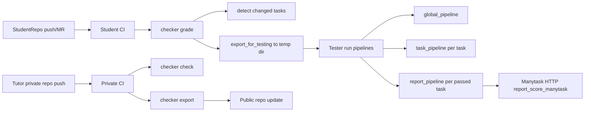

### 1) Корень репозитория

- `go.mod`, `go.sum`
  - Зачем: зависимости, версия модуля.
  - Реализовать: аккуратный набор библиотек (HTTP, логирование, очередь, БД, observability), без лишнего.

- `README.md`
  - Зачем: запуск локально, архитектура, переменные окружения, команды.
  - Реализовать: quickstart для `checkerd` и `checker-worker`.

- `Makefile`
  - Зачем: единые команды сборки/тестов/линта.
  - Реализовать: `make test`, `make lint`, `make build`, `make run-api`, `make run-worker`.

- `.golangci.yml`
  - Зачем: единые правила качества.
  - Реализовать: линтеры `govet`, `staticcheck`, `errcheck`, `gocritic`, `ineffassign`, `unused`.

- `Dockerfile.checkerd`, `Dockerfile.worker`
  - Зачем: отдельные образы для API/диспетчера и воркера.
  - Реализовать: multi-stage build, non-root user, минимальный runtime-образ.

- `configs/`
  - `checkerd.yaml`
  - `worker.yaml`
  - Зачем: декларативная конфигурация сервисов.
  - Реализовать: таймауты, DSN, queue topic/stream, лимиты воркеров, sandbox policy.

### 2) Точки входа (`cmd`)

#### `cmd/checkerd/main.go`
- Роль: старт API + dispatcher/scheduler.
- Структуры/функции:
  - `func main()`
  - `func run(ctx context.Context) error`
  - инициализация: config, logger, metrics, tracer, DB, queue producer/consumer.
  - запуск HTTP server (`/healthz`, `/readyz`, `/api/v1/...`).
  - graceful shutdown.

#### `cmd/checker-worker/main.go`
- Роль: старт worker process для выполнения run jobs.
- Структуры/функции:
  - `func main()`
  - `func runWorker(ctx context.Context) error`
  - поднятие worker pool, подписка на очередь, обработка SIGTERM.
  - ограничение конкурентности (N goroutines + semaphore).

### 3) Доменный слой (`internal/domain`)

Это ядро без инфраструктуры.

#### `internal/domain/task/spec.go`
- Роль: единая модель задачи.
- Структуры:
  - `type TaskSpec struct`
  - `type Metadata struct`
  - `type SolutionSpec struct`
  - `type TestStage struct`
  - `type Constraints struct`
  - `type RuntimeSpec struct`
  - `type ReportingSpec struct`
- Функции:
  - `func (t TaskSpec) Validate() error`
  - `func (t TaskSpec) StageByID(id string) (TestStage, bool)`
- Что важно: строгая валидация (`language`, `timeouts`, `weights`, `entrypoint`).

#### `internal/domain/run/request.go`
- Роль: модель входящего запроса на прогон.
- Структуры:
  - `type RunRequest struct`
  - `type SubmissionRef struct`
  - `type RetryPolicy struct`
- Функции:
  - `func (r RunRequest) Validate() error`
  - `func (r RunRequest) IdempotencyKey() string`

#### `internal/domain/run/result.go`
- Роль: модель результата прогона.
- Структуры:
  - `type RunStatus string` (`queued`, `running`, `passed`, `failed`, `infra_error`, ...)
  - `type RunResult struct`
  - `type StageResult struct`
- Функции:
  - `func (r *RunResult) Finalize()`
  - `func (r RunResult) Score() float64`

#### `internal/domain/errors/errors.go`
- Роль: типизированные доменные ошибки.
- Структуры:
  - `var ErrInvalidTaskSpec`, `ErrRunNotFound`, ...
  - `type Kind string`
  - `type DomainError struct { Kind, Op, Msg, Err }`
- Функции:
  - `func Wrap(op string, err error) error`
  - `func IsKind(err error, k Kind) bool`

### 4) Use-case слой (`internal/application`)

#### `internal/application/submit/service.go`
- Роль: принять сабмит, создать `RunRequest`, положить в очередь.
- Структуры:
  - `type Service struct { RunsRepo; TaskRegistry; Queue; Clock }`
- Функции:
  - `func (s *Service) Submit(ctx context.Context, in SubmitInput) (SubmitOutput, error)`
- Обязанности:
  - идемпотентность;
  - резолв активной версии задачи;
  - запись run в `queued`.

#### `internal/application/dispatch/service.go`
- Роль: планирование, ретраи, дедупликация, приоритизация.
- Функции:
  - `func (s *Service) Enqueue(ctx context.Context, req RunRequest) error`
  - `func (s *Service) RequeueFailed(ctx context.Context) error`

#### `internal/application/execute/service.go`
- Роль: выполнить run на воркере.
- Функции:
  - `func (s *Service) Execute(ctx context.Context, job QueueJob) error`
- Обязанности:
  - скачать submission artifact;
  - получить `TaskSpec`;
  - вызвать sandbox runner;
  - сохранить stage results + score;
  - отправить callback/report.

#### `internal/application/report/service.go`
- Роль: отправка результата во внешний сервис (Manytask).
- Функции:
  - `func (s *Service) Publish(ctx context.Context, result RunResult) error`

### 5) Порты (интерфейсы) (`internal/ports`)

- `internal/ports/queue.go`
  - `type Queue interface { Publish(...); Consume(...) }`
  - `type Message interface { Ack(); Nack(); Retry() }`

- `internal/ports/task_registry.go`
  - `type TaskRegistry interface { GetTaskSpec(...); PutTaskSpec(...); ResolveActiveVersion(...) }`

- `internal/ports/runs_repo.go`
  - `type RunsRepository interface { CreateRun(...); UpdateStatus(...); SaveResult(...); GetRun(...) }`

- `internal/ports/sandbox_runner.go`
  - `type SandboxRunner interface { Execute(ctx context.Context, req ExecuteRequest) (ExecuteResult, error) }`

- `internal/ports/artifacts.go`
  - `type ArtifactStore interface { FetchSubmission(...); PutLogs(...); PutReport(...) }`

### 6) Адаптеры входа (`internal/adapters/inbound`)

- `internal/adapters/inbound/http/router.go`
  - `func NewRouter(deps Deps) http.Handler`
  - Endpoints: `POST /api/v1/submissions`, `GET /api/v1/runs/{id}`, `GET /healthz`, `GET /readyz`

- `internal/adapters/inbound/http/handlers_submission.go`
  - `func (h *Handler) Submit(w http.ResponseWriter, r *http.Request)`

- `internal/adapters/inbound/http/handlers_runs.go`
  - `func (h *Handler) GetRun(...)`
  - `func (h *Handler) GetRunLogs(...)`

- `internal/adapters/inbound/queue/consumer.go`
  - `func (c *Consumer) Start(ctx context.Context) error`
  - `func (c *Consumer) handle(msg ports.Message) error`

### 7) Адаптеры выхода (`internal/adapters/outbound`)

- Queue
  - `internal/adapters/outbound/queue/nats/producer.go`
  - `internal/adapters/outbound/queue/nats/consumer.go`
  - Функционал: publish/consume, retry headers, dead-letter subject.

- Task Registry
  - `internal/adapters/outbound/taskregistry/postgres/repo.go`
  - Функционал: хранение `TaskSpec` версий, active version per task/course.

- Results / Runs Repo
  - `internal/adapters/outbound/runs/postgres/repo.go`
  - Функционал: CRUD run, stage results, индексы по `studentId/taskId/status`.

- Artifact Store
  - `internal/adapters/outbound/artifacts/s3/store.go`
  - Функционал: хранение submission tarball, логов, junit/json отчётов.

- Sandbox Runner
  - `internal/adapters/outbound/runner/docker/runner.go`
  - Функционал:
    - запуск контейнера с лимитами CPU/memory/pids;
    - mount workspace read-only + writable `/tmp`;
    - выполнение стадий по порядку;
    - сбор stdout/stderr/exit code/duration.
  - Ключевые функции:
    - `Execute(...)`
    - `prepareWorkspace(...)`
    - `runStage(...)`
    - `collectArtifacts(...)`

- Manytask client
  - `internal/adapters/outbound/manytask/client.go`
  - Функционал: отправка score/verdict, retries, backoff, idempotency header.

### 8) Пайплайн исполнения (`internal/pipeline`)

- `internal/pipeline/engine.go`
  - `type Engine struct`
  - `func (e *Engine) Run(ctx context.Context, spec task.TaskSpec, env ExecEnv) ([]run.StageResult, error)`

- `internal/pipeline/stage_executor.go`
  - `func ExecuteStage(ctx context.Context, stage task.TestStage, rt RuntimeAdapter) (run.StageResult, error)`

- `internal/pipeline/scoring.go`
  - `func WeightedScore(results []run.StageResult, spec task.ReportingSpec) float64`

- `internal/pipeline/policy.go`
  - `func ShouldStop(policy string, stageResult run.StageResult) bool`

### 9) Конфиг и bootstrap (`internal/platform`)

- `internal/platform/config/config.go`
  - `type Config struct { HTTP, DB, Queue, Runner, Observability ... }`
  - `func Load(path string) (Config, error)`
  - `func (c Config) Validate() error`

- `internal/platform/logging/logger.go`
  - `func NewLogger(cfg LogConfig) (*zap.Logger, error)`

- `internal/platform/observability/metrics.go`
  - `func RecordRunStarted(...)`
  - `func RecordStageDuration(...)`
  - `func RecordRunResult(...)`

- `internal/platform/observability/tracing.go`
  - `func InitTracer(...) (shutdown func(context.Context) error, err error)`

- `internal/platform/clock/clock.go`
  - `type Clock interface { Now() time.Time }`

### 10) API контракты (`api/openapi`)

- `api/openapi/openapi.yaml`
  - submit endpoint,
  - run status endpoint,
  - ошибки (`validation_error`, `not_found`, `infra_error`).

### 12) Тесты (`tests` + `internal/.../*_test.go`)

- `internal/domain/.../*_test.go` — валидация моделей.
- `internal/pipeline/*_test.go` — fail policy, scoring, timeout.
- `tests/integration/submit_to_result_test.go` — полный happy path.
- `tests/e2e/worker_retry_test.go` — retry + DLQ.
- `tests/fixtures/tasks/...` — реальные task spec фикстуры (python/java/go).

---

### Текущий  flow

- CLI точки входа: `checker/__main__.py` (`grade`, `check`, `export`, `validate`)
- Оркестрация пайплайнов: `checker/tester.py`
- Логика стадий, `run_if`, `fail`-политики, outputs: `checker/pipeline.py`
- Детекция изменений по git: `checker/course.py`
- Репорт score в Manytask: `checker/plugins/manytask.py`
- Экспорт и git push: `checker/exporter.py`
- Контекст инфраструктуры: `docs/0_concepts.md`, `docs/1_getting_started.md`, `README.md`

### 1) Нет реальной очереди и рабочей параллельности задач
- Причина: `--parallelize`/`--num-processes` есть в CLI, но runtime идёт последовательно.
- Impact: линейный рост времени, плохой throughput в пик.
- Предложения:
  - ввести bounded worker pool;
  - сделать реальное параллельное выполнение задач;
  - добавить очередь job’ов (минимум in-memory, затем брокер).

### 2) Полная синхронность pipeline-стадий
- Причина: `PipelineRunner.run()` исполняет стадии строго по циклу.
- Impact: медленные stage блокируют всё.
- Предложения:
  - поддержать параллельные независимые стадии

### 3) I/O перегрузка при копировании/экспорте файлов
- Причина: множественные обходы дерева, повторные чтения файлов.
- Impact: долгий `export_for_testing`/`export_public` на больших курсах.
- Предложения:
  - кэшировать результаты glob/классификации;
  - убрать повторные read одного файла;
  - дедуп путей перед копированием.

### 4) Хрупкие git-операции в export
- Причина: `subprocess` без retry/backoff, частично `shell=True`.
- Impact: flaky push/commit в CI.
- Предложения:
  - перейти на безопасные argv-вызовы;
  - retry policy для push;
  - явная типизация ошибок git-слоя.

### 5) Сетевой слой Manytask plugin недооформлен
- Причина: есть retry, но нет явных timeout для HTTP POST; ресурсы открытых файлов требуют аккуратного закрытия.
- Impact: зависания/флапы при деградации сети.
- Предложения:
  - добавить connect/read timeout;
  - унифицировать HTTP client policy для интеграций.